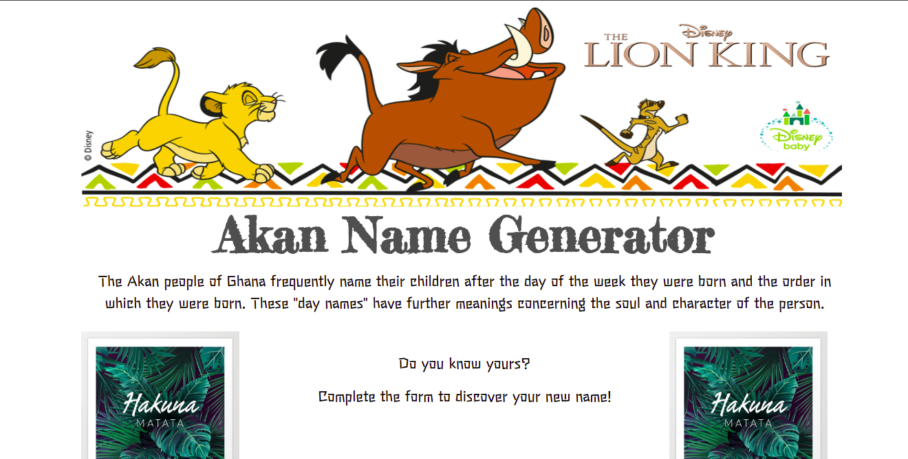
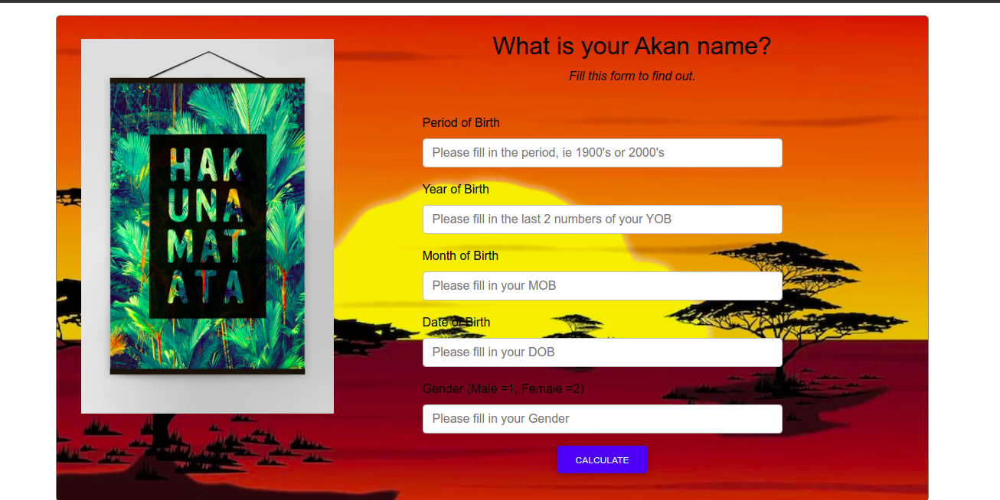

# ageProject
# My Portfolio

    

  <h3 align="center">AKAN NAME GENERATOR</h3>
  

    The Akan people of Ghana frequently name their children after the day of the week they were born and the order in which they were born. These "day names" have      further meanings concerning the soul and character of the person.
     
    <a href="https://fltoki.github.io/ageProject">View Demo</a>
    ·
    <a href="#">Report Bug</a>
    ·
    <a href="#">Request Feature</a>
  

  
   

      
TABLE OF CONTENTS

      <ol>
        <li>
          <a href="#about-the-project">About The Project</a>
          <ul>
            <li><a href="#built-using">Built Using</a></li>
          </ul>
        </li>
        <li><a href="#license">How to Use</a></li>
        <li><a href="#license">License</a></li>
        <li><a href="#contact">Contact</a></li>
      </ol>
    

## Author
Built by: Musyoki Jim.

## About The Project

The Akan name generator uses data from the user to calculate the exact day of the week a person was born and from that, present an Akan name, based on their gender. The data used includes: Period/Century, Year, Month and Date of birth, basically, a person's birthday.  

### Built Using
I used the following resources in its development
* [Bootstrap](https://getbootstrap.com)
* [JAVASCRIPT](https://javascript.com)
* [HTML](https://html.com)
* [CSS](https://css.com)

# How to Use
Enter all the required data in the form presented on the page as per specifications,

In the period box, enter the first 2 numbers of your birth year, e.g for 1992, enter 19.
in the year box, enter the last 2 numbers of your birth year, e.g for 1992, enter 92
In the month box, enter your month of birth. Lastly, enter your date of birth and gender.
For gender, enter 1 for male, 2 for female.

N/B: All data entered should be numerical, as would be in the format DD/MM/YYYY.

# License
Distributed under the MIT License. See `LICENSE` for more information.

## Contact
* Jim Musyoki - [Email:](https://musyokijim@gmail.com)
* Project Link: [Portfolio link](https://fltoki.github.io/ageProject)
